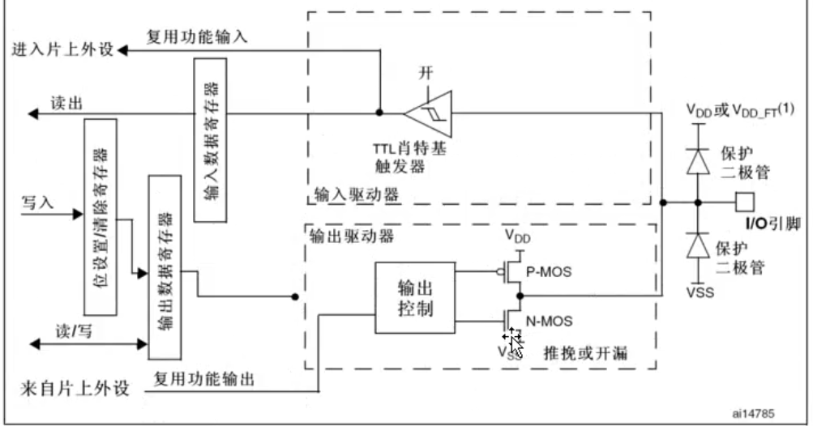

## 一句话定义

GPIO复用功能允许引脚复用为USART、SPI、I2C、ADC、定时器等其他外设功能,通过配置复用功能模式和多路选择器切换信号通路。

## 核心内容

### 复用功能概念

- **基本原理**:引脚可复用为非GPIO功能,由外设模块直接控制
- **核心区别**:信号来自片上外设而非CPU直接控制
- **配置要求**:必须配置为复用功能输出模式(推挽或开漏)

### 复用功能分类
- **复用输出**:
  - 来自其他外设的信号绕过ODR直接输出
  - 外设输出信号→多路选择器→引脚
  - 典型应用:USART_TX、SPI_MOSI、I2C_SCL等
- **复用输入**:
  - 信号直接传输至其他外设而不经过IDR
  - 引脚→多路选择器→外设输入
  - 典型应用:USART_RX、SPI_MISO、I2C_SDA等
- **双向复用**:
  - 复用输出模式下,输入驱动器自动配置为浮空输入
  - 支持半双工通信协议
  - 典型应用:单线半双工通信协议实现

### 电路实现
- **多路选择器**:切换信号通路,断开与输出寄存器的连接
- **复用输出模式**:外设功能使用推挽或开漏输出结构
- **双向特性**:复用输出模式下复用输入通道仍保持开启

### 配置方法
- **输出配置**:必须设置为复用功能输出模式(推挽或开漏)
- **输入配置**:必须设置为输入模式(浮空、上拉或下拉)并由外部驱动
- **双向配置**:设置为复用输出模式时,输入驱动器自动配置为浮空输入
- **软件模拟**:可通过GPIO控制器编程模拟复用输入功能
- **重映射机制**:允许将复用功能重新映射到其他引脚,提高设计灵活性

### 典型复用功能
- **通信协议**:
  - USART:TX/RX引脚
  - SPI:MOSI/MISO/SCK/NSS引脚
  - I2C:SCL/SDA引脚
- **定时器**:
  - TIM:PWM输出引脚、捕获/比较引脚
- **模拟外设**:
  - ADC:模拟输入通道
  - DAC:模拟输出通道

### 复用功能模式对比
| 模式 | 信号来源 | 应用场景 |
|------|---------|---------|
| 通用推挽 | CPU直接控制(ODR) | LED控制、GPIO输出 |
| 通用开漏 | CPU直接控制(ODR+外接上拉) | 电平转换、总线控制 |
| 复用推挽 | 外设输出信号 | USART_TX、SPI_MOSI |
| 复用开漏 | 外设输出信号(需外接上拉) | I2C_SCL、I2C_SDA |

### 锁定机制
- LOCK程序可冻结IO配置,直到下次复位前不可更改
- 用于防止关键GPIO配置被意外修改

### 注意事项
- 外设未激活时输出状态不确定,需确保外设正常工作
- 复用功能时ODR寄存器与物理引脚断开连接,不受ODR值影响
- 使用复用功能前必须先使能对应外设的时钟

## 注意事项 & 踩坑

- 复用功能必须配置为对应的复用推挽或复用开漏模式,不能配置为通用输出模式
- 复用输出模式下,ODR寄存器与引脚断开连接,输出由外设模块决定
- 使用复用功能前必须先使能对应外设的时钟(RCC_APB2ENR或RCC_APB1ENR)
- 复用功能引脚与通用GPIO功能冲突,不能同时使用
- 注意引脚复用时的功能冲突(如PA1与UART2_TX复用)

## 相关笔记

- [GPIO概述与基本特点](GPIO概述与基本特点.md)
- [8种工作模式分类](8种工作模式分类.md)
- [GPIO配置寄存器CRL与CRH](GPIO配置寄存器CRL与CRH.md)

## 参考来源

- 尚硅谷嵌入式技术之STM32单片机课程
- STM32中文参考手册