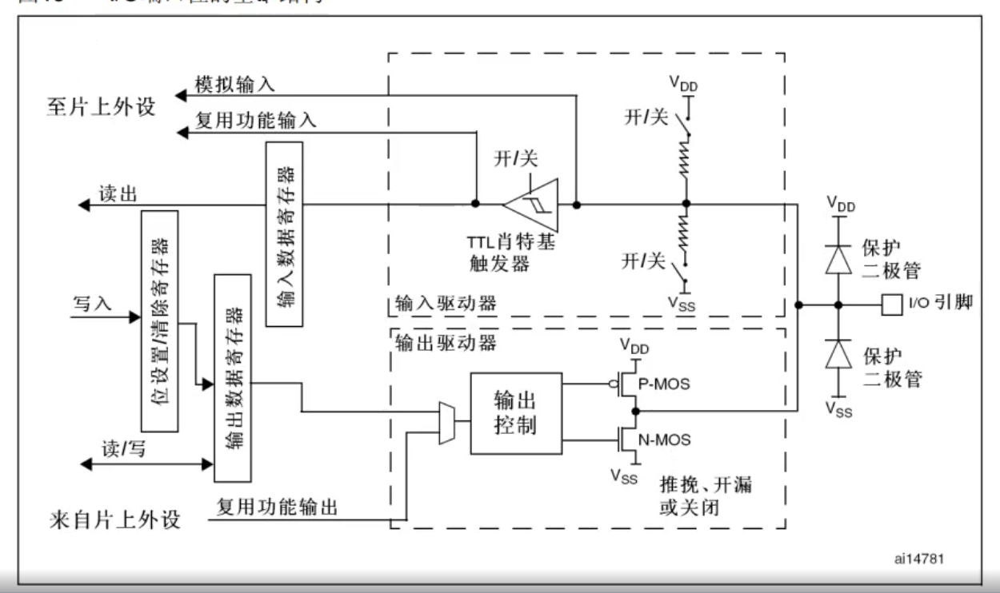

## 一句话定义

每个GPIO引脚对应STM32芯片的一个物理引脚,通过上/下半部分电路分别实现输入和输出功能,由寄存器中的位(bit)而非整个寄存器来控制。

## 核心内容

### 基本结构

- 

### 核心组件
- **保护二极管**:防止过压损坏,通过上下两个二极管将输入电压钳位在VDD(3.3V)和VSS(0V)之间
- **施密特触发器**:用于数字信号整形,消除输入信号毛刺,提高抗干扰能力
  - 设置电压上限和下限
  - 输入电压>上限输出高电平,<下限输出低电平
  - 在上下限之间保持原状态(滞回特性)
- **P-MOS/N-MOS管**:实现推挽和开漏输出
  - 推挽模式:两个MOS管交替工作
  - 开漏模式:P-MOS永久关闭,仅N-MOS工作
- **上拉/下拉电阻**:可配置的输入模式,决定无输入时的默认状态

### 电路分区
- **上半部分(输入驱动器)**:连接输入数据寄存器(IDR)
  - 信号路径:引脚→保护电路→施密特触发器→IDR→数据总线
- **下半部分(输出驱动器)**:连接输出数据寄存器(ODR)
  - 信号路径:数据总线→ODR→MOS管驱动→引脚

### 数据流向
- **输入时**:外部引脚→保护二极管→施密特触发器→IDR→CPU读取
- **输出时**:CPU→ODR→MOS管→引脚输出

### 复用功能与模拟输入
- **复用功能**:
  - 复用输出:来自其他外设的信号绕过ODR直接输出
  - 复用输入:信号直接传输至其他外设而不经过IDR
  - 使用多路选择器切换信号通路
- **模拟输入**:
  - 模拟信号直接接入ADC,不经过数字信号处理电路
  - 施密特触发器、上下拉电阻均被禁止,实现零功耗
  - 读取IDR时固定返回0值

## 注意事项 & 踩坑

- 中文手册中"肖特基触发器"应为翻译错误,正确名称为TTL Schmitt Trigger
- 保护二极管:当输入电压>VDD时上二极管导通,<VSS时下二极管导通
- 输出模式下,输出驱动器完全激活,输入驱动器仍可通过施密特触发器读取引脚状态
- 模拟输入模式下,输出部分完全关闭,仅保留保护二极管

## 相关笔记

- [GPIO概述与基本特点](GPIO概述与基本特点.md)
- [推挽输出模式](推挽输出模式.md)
- [开漏输出模式](开漏输出模式.md)
- [GPIO输入模式](GPIO输入模式.md)
- [模拟输入模式](模拟输入模式.md)

## 参考来源

- 尚硅谷嵌入式技术之STM32单片机课程
- STM32中文参考手册