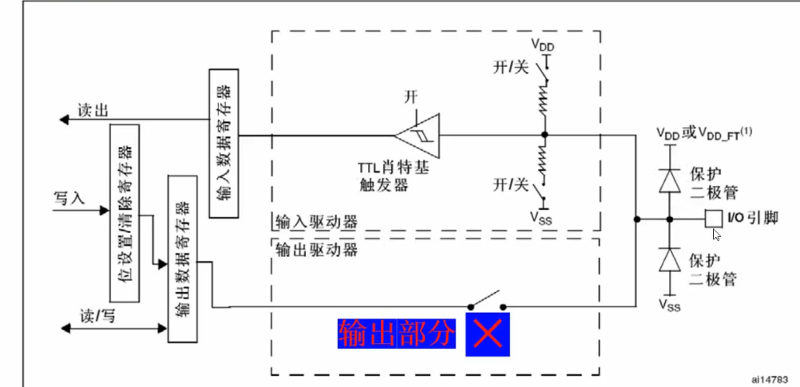

## 一句话定义

GPIO输入模式下输出驱动器完全关断,输入信号经保护二极管限幅、施密特触发器整形后存入IDR寄存器供CPU读取。

## 核心内容

### 输入模式分类
- **浮空输入**:上下拉电阻均断开,完全依赖外部输入信号,默认低功耗状态(复位后不耗电)
- **上拉输入**:上开关闭合,默认输出高电平(1)
- **下拉输入**:下开关闭合,默认输出低电平(0)
- **模拟输入**:专用ADC模式,禁用施密特触发器和上下拉电阻,实现零功耗

### 输入流程
1. **输出部分关断**:在输入模式下,输出驱动器完全失效,仅关注输入驱动器部分
2. **保护机制**:
   - 保护二极管将输入电压钳位在VDD(3.3V)和VSS(0V)之间
   - 当输入电压>VDD时上二极管导通,<VSS时下二极管导通
3. **上下拉控制**:
   - 上拉模式:上开关闭合,默认高电平
   - 下拉模式:下开关闭合,默认低电平
   - 浮空模式:两开关均断开,呈高阻态
   - 无效组合:两开关同时闭合会导致中间电位且耗电
4. **信号整形**:
   - 设置电压上限和下限
   - 输入电压>上限输出高电平,<下限输出低电平
   - 在上下限之间保持原状态(滞回特性)
   - 消除输入信号毛刺,输出规整的方波信号
5. **寄存器读取**:整形后的信号存入GPIOx_IDR,CPU通过读取该寄存器获取引脚状态

### 核心组件功能
- **保护二极管**:防止输入电压过高/过低损坏芯片
- **上下拉电阻**:提供无输入时的默认状态,避免悬空高阻态
- **施密特触发器**:消除毛刺,确保数字信号质量,提供噪声抑制

### 数据流向
- 输入路径:引脚→保护二极管→施密特触发器→输入数据寄存器(IDR)→CPU读取
- 输入数据在每个APB2时钟周期采样到IDR

### 应用场景
- **浮空输入**:外部电路已提供确定电平的场合
- **上拉输入**:按键检测(默认高电平,按下时接地)
- **下拉输入**:按键检测(默认低电平,按下时接高电平)
- **模拟输入**:ADC电压采集、模拟通信协议接收

## 注意事项 & 踩坑

- 上下拉电阻不影响输入电平,仅提供默认状态
- 中文手册中"肖特基触发器"应为翻译错误,正确名称为TTL Schmitt Trigger
- 复位后所有GPIO默认为浮空输入模式
- 输入模式下,写入ODR寄存器的值不影响引脚状态
- 施密特触发器输出在输入电压处于上下限之间时保持原状态,具有滞回特性

## 相关笔记

- [GPIO引脚电路结构](GPIO引脚电路结构.md)
- [模拟输入模式](模拟输入模式.md)
- [GPIO数据寄存器IDR与ODR](GPIO数据寄存器IDR与ODR.md)

## 参考来源

- 尚硅谷嵌入式技术之STM32单片机课程
- STM32中文参考手册