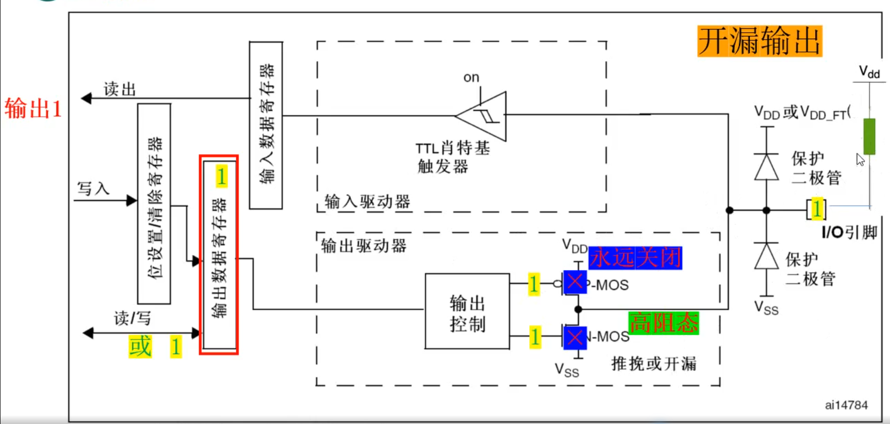

## 一句话定义

开漏输出模式下P-MOS管永久关闭,仅保留N-MOS管工作,输出0时接地,输出1时呈高阻态,必须外接上拉电阻才能实现高电平输出。

## 核心内容

### 电路结构

- **核心特点**:P-MOS管永久关闭,仅保留N-MOS管工作
- **命名由来**:N-MOS管的漏极(Drain)直接开放(Open)连接输出引脚

### 工作原理
- **输出低电平**:
  - 激活N-MOS管,输出VSS(低电平)
  - 正常接地,与推挽输出相同
- **输出高电平**:
  - N-MOS管关闭,输出高阻态
  - 必须外接上拉电阻才能输出高电平
  - 电平由上拉电阻连接的电源电压决定

### 状态读取
- **读IDR**:返回实际I/O状态(可能受外部电路影响)
- **典型应用**:I²C总线等需要"线与"逻辑的场合

### 核心特性
- **总线应用**:
  - 线与特性:多个开漏输出可并联形成"线与"逻辑
  - 冲突避免:任一输出低电平将拉低整条总线,避免短路风险
- **电平转换**:
  - 通过改变上拉电阻连接的电源电压,可灵活调整输出高电平电压值
  - 可实现3.3V→5V等电压转换

### 基本配置
- **强制设置**:上管P-MOS永久关闭
- **必要元件**:必须外接上拉电阻才能实现高电平输出
- **电阻选择**:上拉电阻阻值需根据实际应用场景选择

### 典型应用场景
- **总线通信**:I²C等需要多设备并联的通信协议
- **电平转换**:在不同电压系统间(如3.3V与5V系统)进行电平转换
- **信号控制**:需要实现硬件"与"逻辑的场合

### 与推挽输出的选择
- **推挽输出适用**:
  - 需要较强的驱动能力
  - 高速信号传输场景
  - 点对点连接
- **开漏输出适用**:
  - 总线连接需求
  - 电压转换需求
  - 外部上拉需求

## 注意事项 & 踩坑

- 必须外接上拉电阻才能实现高电平输出,否则输出1时无法确定电平
- 输出1时为高阻态,实际电平取决于外部电路
- 多个开漏输出并联时,任一输出低电平将拉低整条总线
- 复用功能开漏模式用于I²C等特定总线协议
- 复位后默认为浮空输入模式,必须配置为开漏输出模式才能使用

## 相关笔记

- [8种工作模式分类](8种工作模式分类.md)
- [推挽输出模式](推挽输出模式.md)
- [GPIO配置寄存器CRL与CRH](GPIO配置寄存器CRL与CRH.md)
- [GPIO数据寄存器IDR与ODR](GPIO数据寄存器IDR与ODR.md)

## 参考来源

- 尚硅谷嵌入式技术之STM32单片机课程
- STM32中文参考手册