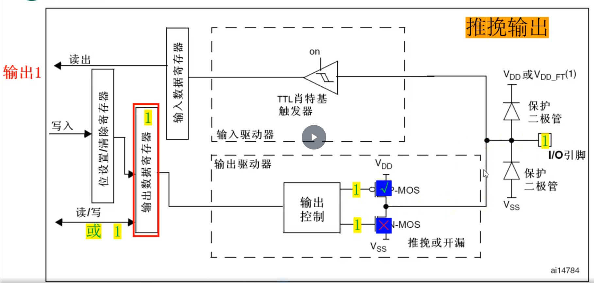

## 一句话定义

推挽输出是由P-MOS和N-MOS晶体管组成互补输出结构,两个MOS管交替导通,实现强驱动能力的电平输出。

## 核心内容

### 电路结构

- **核心组成**:P-MOS管(上管)和N-MOS管(下管)的漏极相连构成输出端
- **工作特点**:两个MOS管交替工作,同一时间只有一个工作

### 工作原理
- **输出高电平**:
  - ODR=1→反向为0→P-MOS导通→输出VDD高电平(推电流)
  - 电流从芯片向外流出
- **输出低电平**:
  - ODR=0→反向为1→N-MOS导通→输出VSS低电平(拉电流)
  - 电流从外部向芯片流入

### 控制方式
- **直接控制**:直接向ODR寄存器写入0/1值
- **间接控制**:通过设置/清除寄存器(BSRR)写1来控制ODR寄存器
  - BSRR低16位(BS):置位操作,对应ODR位设为1
  - BSRR高16位(BR):清除操作,对应ODR位设为0

### 输出特性
- **驱动能力**:可输出强高低电平,无需外接电路
- **切换速度**:采用半桥MOS管结构,具有较快的切换速度
- **功率消耗**:功率消耗小,切换频率高

### 反馈机制
- 输出模式下仍可通过施密特触发器读取引脚状态到IDR寄存器
- 可用于监测实际输出电平

### 应用场景
- **适用场景**:
  - 需要较强驱动能力的电路
  - 高速信号传输场景
  - 点对点连接
- **典型应用**:
  - 驱动LED、蜂鸣器等小功率设备
  - 控制继电器(需额外驱动器)
  - 数字信号输出

### 命名由来
- 源自"一推一拉"的工作方式(Push-Pull)
- 中文译为"推挽"

## 注意事项 & 踩坑

- 多个推挽输出引脚不能直接并联,否则可能造成短路
- 仅适用于点对点连接场景,不能用于需要共用信号线的总线连接
- 大功率设备需要额外驱动器,不能直接由GPIO驱动
- 复位后默认为浮空输入模式,必须配置为输出模式才能使用

## 相关笔记

- [8种工作模式分类](8种工作模式分类.md)
- [开漏输出模式](开漏输出模式.md)
- [GPIO配置寄存器CRL与CRH](GPIO配置寄存器CRL与CRH.md)
- [GPIO数据寄存器IDR与ODR](GPIO数据寄存器IDR与ODR.md)

## 参考来源

- 尚硅谷嵌入式技术之STM32单片机课程
- STM32中文参考手册