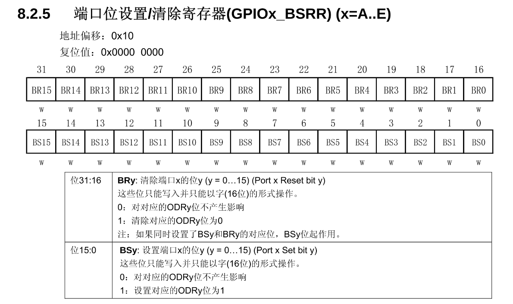
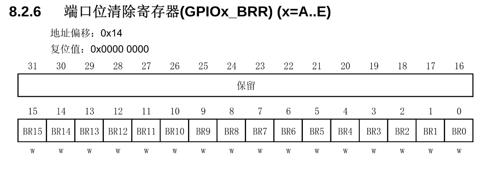
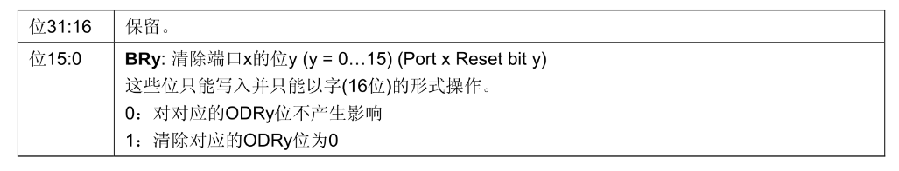

## 一句话定义

GPIOx_BSRR(位设置/清除寄存器)支持原子操作,低16位BS用于置位,高16位BR用于清除;GPIOx_BRR(位清除寄存器)仅保留清除功能。

## 核心内容



### BSRR(端口位设置/清除寄存器)
- **寄存器定义**:原子操作设置/清除GPIO端口位
- **地址偏移**:0x10
- **复位值**:0x00000000
- **位域划分**:
  - 位31-16:BRy (清除位,y=0-15)
  - 位15-0:BSy (置位位,y=0-15)

### BSRR功能说明
#### 置位位(BSy,位15-0)
- **功能**:设置端口x的位y (y=0-15)
- **操作特性**:
  - 只能写入
  - 必须以字(32位)形式操作
- **取值含义**:
  - 0:对对应的ODRy位不产生影响
  - 1:设置对应的ODRy位为1
- **等效关系**:BSRR[15:0]功能等效于直接写ODR

#### 清除位(BRy,位31-16)
- **功能**:清除端口x的位y (y=0-15)
- **操作特性**:
  - 只能写入
  - 必须以字(32位)形式操作
- **取值含义**:
  - 0:对对应的ODRy位不产生影响
  - 1:清除对应的ODRy位为0
- **特殊说明**:如果同时设置BSy和BRy的对应位,BSy位起作用(置1操作优先)

### BSRR操作原理
- **操作逻辑**:
  - 写入BSy位1:对应ODRy位置1
  - 写入BRy位1:对应ODRy位置0
  - 同时设置BSy和BRy:BSy优先(置1操作优先)
- **编程优势**:
  - 避免直接操作ODR时的位操作复杂性
  - 代码格式统一(全部使用位或操作)
  - 减少出错概率(无需处理位取反)
  - 支持原子操作,避免读-修改-写过程中的竞态条件

### BRR(端口位清除寄存器)





- **寄存器定义**:完全冗余的辅助寄存器,专门用于清除GPIO端口位
- **地址偏移**:0x14
- **复位值**:0x00000000
- **位域结构**:
  - 低16位:BR0-BR15,有效
  - 高16位:保留(与BSRR寄存器布局相反)
- **位操作机制**:
  - 每个BRy位对应ODRy输出数据位(y=0-15)
  - 写入1时清除对应ODRy位为0
  - 写入0时不产生影响
- **设计特点**:将BSRR的高16位BR功能独立为低16位寄存器

### BRR使用建议
- **操作分工**:
  - BSRR的BS位(低16位)专用于置位操作
  - BRR寄存器专用于清零操作
- **优势**:
  - 避免混淆置位/清零操作
  - 提高代码可读性(但非必须使用)

### 编程示例对比
#### 传统ODR操作方式
```c
// 置位
GPIOA->ODR |= GPIO_ODR_ODR0;

// 清零
GPIOA->ODR &= ~GPIO_ODR_ODR0;
```

#### BSRR操作方式(推荐)
```c
// 置位
GPIOA->BSRR = GPIO_BSRR_BS0;

// 清零
GPIOA->BSRR = GPIO_BSRR_BR0;
// 或者
GPIOA->BRR = GPIO_BRR_BR0;
```

#### 编程建议
- **使用BSRR可使代码更简洁**
- **所有操作统一为置位操作(BSy或BRy)**
- **避免混合使用ODR和BSRR操作方式**

### 寄存器对比
| 寄存器 | 功能 | 位宽 | 原子操作 | 编程优势 |
|-------|------|------|---------|---------|
| ODR | 设置输出状态 | 16位 | 否 | 直接控制 |
| BSRR | 置位/清除 | 32位 | 是 | 避免位操作错误 |
| BRR | 清除 | 16位 | 是 | 提高代码可读性 |

## 注意事项 & 踩坑

- BSRR和BRR必须以32位字形式写入,不能按字节访问
- 同时设置BSy和BRy对应位时,BSy优先(置1操作优先)
- BSRR操作比直接操作ODR稍慢,但换来更好的代码安全性
- 推荐使用BSRR进行位操作,避免使用ODR的位操作(&= ~/|=)
- BRR是可选寄存器,不是必须使用,完全可以用BSRR替代

## 相关笔记

- [GPIO数据寄存器IDR与ODR](GPIO数据寄存器IDR与ODR.md)
- [GPIO配置寄存器CRL与CRH](GPIO配置寄存器CRL与CRH.md)

## 参考来源

- 尚硅谷嵌入式技术之STM32单片机课程
- STM32中文参考手册