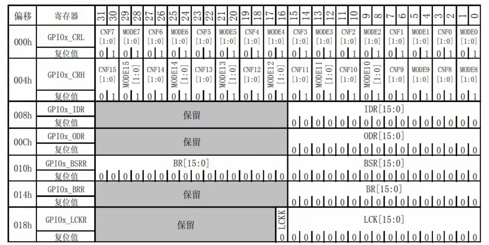

## 一句话定义
GPIO（通用输入输出端口）是STM32最基础的外设，可通过配置寄存器实现输入、输出、复用等功能，是控制外部设备和采集信号的核心接口。

## 核心内容

### 1. GPIO寄存器结构
每个GPIO端口（A-G）包含5个核心寄存器：

| 寄存器名称 | 偏移地址 | 功能 | 位宽 |
| --- | --- | --- | --- |
| GPIOx_CRL | 0x00 | 端口配置低寄存器，控制引脚0-7 | 32位 |
| GPIOx_CRH | 0x04 | 端口配置高寄存器，控制引脚8-15 | 32位 |
| GPIOx_IDR | 0x08 | 端口输入数据寄存器，只读，读取引脚电平 | 16位有效 |
| GPIOx_ODR | 0x0C | 端口输出数据寄存器，读写，控制引脚输出电平 | 16位有效 |
| GPIOx_BSRR | 0x10 | 端口位设置/清除寄存器，写操作，原子控制引脚 | 32位 |

### 2. GPIO配置位结构
每个引脚由4位控制（2位MODE + 2位CNF）：
#### MODE位（模式选择，位[1:0]）
| 模式值 | 功能 | 说明 |
| --- | --- | --- |
| 00 | 输入模式 | 复位默认模式 |
| 01 | 输出模式，最大速度10MHz | 普通输出 |
| 10 | 输出模式，最大速度2MHz | 低功耗输出 |
| 11 | 输出模式，最大速度50MHz | 高速输出 |

#### CNF位（配置选择，位[3:2]）
输入模式下：

| CNF值 | 功能 | 说明 |
| --- | --- | --- |
| 00 | 模拟输入 | 用于ADC采集、DAC输出 |
| 01 | 浮空输入 | 复位默认状态，电平不确定，适合按键输入 |
| 10 | 上拉/下拉输入 | 可通过ODR寄存器配置上拉或下拉 |
| 11 | 保留 | 未使用 |

输出模式下：

| CNF值 | 功能 | 说明 |
| --- | --- | --- |
| 00 | 通用推挽输出 | 输出高低电平，驱动能力强，最常用 |
| 01 | 通用开漏输出 | 只能输出低电平，高电平为高阻态，需要外部上拉，适合I2C等总线 |
| 10 | 复用推挽输出 | 外设复用功能，如USART_TX、SPI_MOSI |
| 11 | 复用开漏输出 | 外设复用功能，如I2C_SCL、I2C_SDA |

### 3. GPIO 8种工作模式详解
1. **模拟输入**：引脚接模拟信号，用于ADC采集，关闭施密特触发器，功耗最低
2. **浮空输入**：引脚电平由外部电路决定，适合按键、外部中断输入
3. **上拉输入**：内部上拉电阻使能，默认高电平，按下按键时变为低电平
4. **下拉输入**：内部下拉电阻使能，默认低电平，信号有效时变为高电平
5. **推挽输出**：可直接输出高低电平，驱动能力强（最大25mA），适合驱动LED、继电器等
6. **开漏输出**：输出0时为低电平，输出1时为高阻态，需要外部上拉电阻，可实现电平转换
7. **复用推挽输出**：引脚被外设复用，由外设控制输出电平，如串口发送引脚
8. **复用开漏输出**：引脚被外设复用为开漏模式，如I2C总线引脚

### 4. GPIO配置步骤（以PA0推挽输出为例）
1. **开启GPIOA时钟**：`RCC->APB2ENR |= RCC_APB2ENR_IOPAEN`（必须第一步，否则寄存器无法操作）
2. **配置PA0引脚模式**：
   - PA0属于低8位，使用CRL寄存器
   - 清除CNF0和MODE0位：`GPIOA->CRL &= ~(0xF << 0)`（清除PA0对应的4位）
   - 设置MODE0为11（50MHz输出），CNF0为00（推挽输出）：`GPIOA->CRL |= (0x3 << 0)`
3. **控制输出电平**：
   - 输出低电平：`GPIOA->ODR &= ~(1 << 0)`
   - 输出高电平：`GPIOA->ODR |= (1 << 0)`
   - 翻转电平：`GPIOA->ODR ^= (1 << 0)`

### 5. 高低引脚配置区分
- **低8位引脚（Px0-Px7）**：使用CRL寄存器配置，每4位对应一个引脚，Px0对应位[3:0]，Px1对应位[7:4]，以此类推
- **高8位引脚（Px8-Px15）**：使用CRH寄存器配置，每4位对应一个引脚，Px8对应位[3:0]，Px9对应位[7:4]，以此类推
- 示例：配置PA8为推挽输出
  ```c
  GPIOA->CRH &= ~(0xF << 0); // 清除PA8对应的4位
  GPIOA->CRH |= (0x3 << 0);  // 配置为推挽输出50MHz
  ```

### 6. GPIO输入读取方法
- 读取单个引脚电平：`uint8_t level = (GPIOA->IDR >> 0) & 0x1;`（读取PA0电平，0为低，1为高）
- 读取整个端口电平：`uint16_t port_value = GPIOA->IDR;`（一次性读取PA0-PA15所有引脚电平）

## 注意事项&踩坑
1. 上拉/下拉配置：配置为上拉/下拉输入模式后，需要设置ODR寄存器对应位，置1为上拉，置0为下拉
2. 引脚复用冲突：同一引脚可复用多个功能，使用前需确认复用功能配置正确，避免冲突
3. 5V容忍：STM32大部分引脚为5V容忍，可直接接5V电平，但部分引脚（如ADC引脚）为3.3V，接5V会烧毁芯片，使用前需查看数据手册
4. 输出电流：单个GPIO最大输出电流25mA，总电流不能超过150mA，驱动大电流设备需要加三极管或MOS管
5. 悬空引脚处理：未使用的引脚不要悬空，配置为上拉/下拉输入或模拟输入，避免功耗增加和干扰

## 相关笔记
- [[STM32寄存器编程位操作技巧]]
- [[STM32点亮LED灯实战（寄存器版）]]
