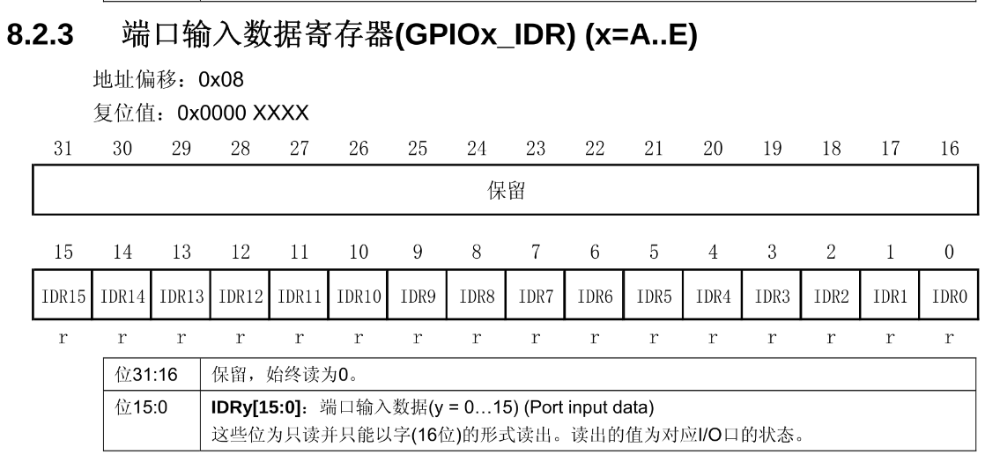
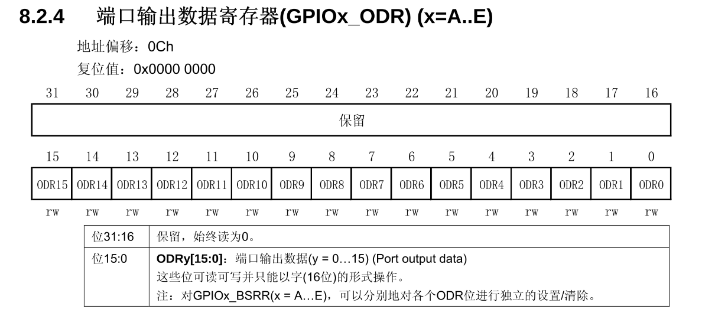

## 一句话定义

GPIOx_IDR(输入数据寄存器)存储引脚输入状态,GPIOx_ODR(输出数据寄存器)控制引脚输出电平,各16位,直接映射引脚电平状态。

## 核心内容

### IDR(端口输入数据寄存器)



- **寄存器定义**:读取GPIO端口0-15引脚输入状态
- **偏移地址**:0x08
- **位域结构**:
  - 高16位:保留(始终读0)
  - 低16位IDRy[15:0]:对应引脚状态(y=0-15)
- **功能说明**:
  - 存储从外部引脚读取的经过施密特触发器处理后的数字信号
  - 只读属性,必须按16位字访问
  - 输出模式下仍可读取实际引脚电平
- **特殊说明**:
  - 模拟输入时IDR固定读0
  - 开漏模式读IDR返回实际I/O状态(可能受外部电路影响)

### ODR(端口输出数据寄存器)



- **寄存器定义**:控制GPIO端口0-15引脚输出电平
- **偏移地址**:0x0C
- **位域结构**:
  - 高16位:保留
  - 低16位ODRy[15:0]:控制输出电平(y=0-15)
- **功能说明**:
  - 直接控制:写入该寄存器可直接控制引脚输出高低电平
  - 可读写寄存器,每个位独立控制对应引脚输出状态
  - 输出模式下写入后立即生效
  - 输入模式下写入值不影响引脚状态
- **复位值**:0x00000000,所有位初始为0

### 通用IO模式与复用功能模式
- **通用IO模式**:
  - ODR寄存器直接控制引脚电平
  - 示例:PA2作为通用输出时,通过ODR2控制输出电平
- **复用功能模式**:
  - ODR寄存器与引脚断开连接
  - 输出由外设模块直接控制
  - 示例:PA2用作USART2_TX时,其输出由USART模块决定,不受ODR2影响

### ODR输出控制原理
- **通过设置ODRy[15:0]的值为0或1,控制对应引脚输出低电平或高电平**:
  - ODR0=0:PA0输出低电平
  - ODR1=1:PA1输出高电平
- **BSRR寄存器优势**:相比直接操作ODR,使用BSRR寄存器可以原子性地单独设置/清除各个ODR位

### 位操作方法
- **直接操作ODR**:
  ```c
  GPIOA->ODR |= GPIO_ODR_ODR0;   // PA0输出高电平
  GPIOA->ODR &= ~GPIO_ODR_ODR0;  // PA0输出低电平
  ```
- **使用BSRR(推荐)**:
  ```c
  GPIOA->BSRR = GPIO_BSRR_BS0;   // PA0输出高电平
  GPIOA->BSRR = GPIO_BSRR_BR0;   // PA0输出低电平
  ```
- **位带操作**:
  ```c
  PAout(0) = 1;  // PA0输出高电平
  PAout(0) = 0;  // PA0输出低电平
  ```

### 输入读取方法
- **读取IDR**:
  ```c
  uint8_t pin_state = GPIO_ReadInputDataBit(GPIOA, GPIO_Pin_0);
  // 或者
  if (GPIOA->IDR & GPIO_IDR_IDR0) {
      // PA0为高电平
  }
  ```
- **读取ODR(推挽模式)**:
  ```c
  uint8_t pin_state = GPIO_ReadOutputDataBit(GPIOA, GPIO_Pin_0);
  // 在推挽模式下,返回最后一次写入的值
  ```

### 复位值与初始状态
- **IDR复位值**:取决于外部电路,不确定
- **ODR复位值**:0x00000000,所有位初始为0
- **引脚初始状态**:复位后所有GPIO默认为浮空输入模式

## 注意事项 & 踩坑

- IDR和ODR都是16位寄存器(仅使用低16位),必须按16位字访问
- 复用功能时,ODR与物理引脚断开连接,输出由外设模块决定
- 推挽模式下读ODR返回最后一次写入的值,读IDR可获取实际引脚状态
- 开漏模式下读IDR返回实际I/O状态,可能受外部电路影响
- 模拟输入时IDR固定为0,不能通过读取IDR获取引脚状态
- 使用BSRR寄存器可实现原子操作,避免读-修改-写过程中的竞态条件

## 相关笔记

- [GPIO配置寄存器CRL与CRH](GPIO配置寄存器CRL与CRH.md)
- [GPIO位操作寄存器BSRR与BRR](GPIO位操作寄存器BSRR与BRR.md)
- [推挽输出模式](推挽输出模式.md)
- [开漏输出模式](开漏输出模式.md)

## 参考来源

- 尚硅谷嵌入式技术之STM32单片机课程
- STM32中文参考手册