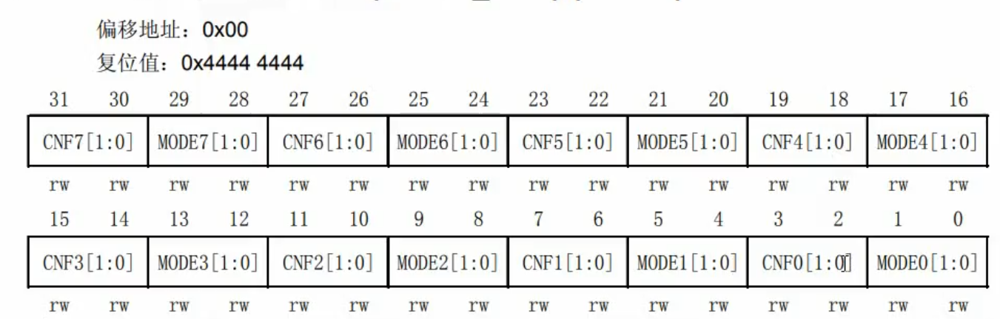
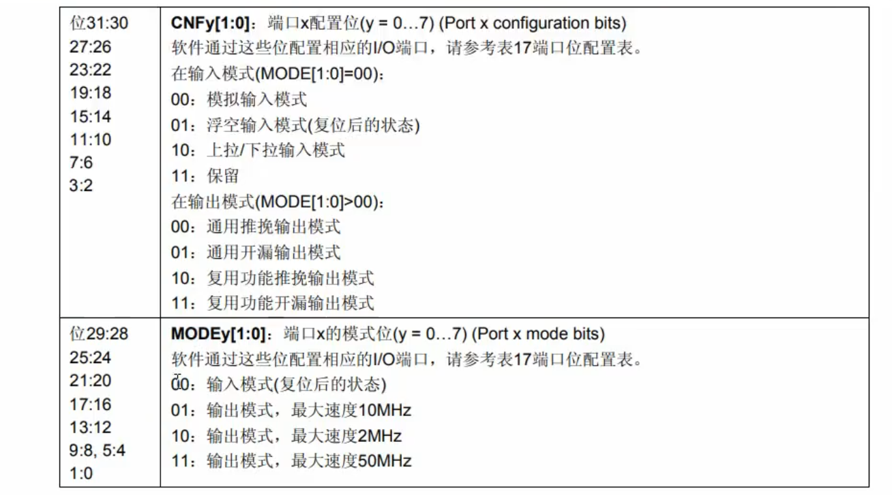

## 一句话定义

GPIOx_CRL配置低8位引脚(0-7),GPIOx_CRH配置高8位引脚(8-15),每4位控制一个引脚,通过CNF和MODE位配置工作模式。

## 核心内容

### 寄存器概述
- **配对使用**:CRL和CRH寄存器成对使用,共同完成16个引脚的完整配置
- **命名含义**:CRL=Configuration Register Low(配置低寄存器),CRH=Configuration Register High(配置高寄存器)
- **寄存器宽度**:均为32位寄存器,必须以32位字方式操作
- **偏移地址**:CRL=0x00,CRH=0x04



### 位域结构
- **配置单元**:每个端口使用4位配置(2位CNF+2位MODE)
- **位数计算**:16个端口×4位=64位,需要两个32位寄存器
- **分配原则**:
  - CRL配置引脚0-7
  - CRH配置引脚8-15
- **位分配**(每个引脚):
  - 高2位:CNF[1:0] (Configuration位,配置位)
  - 低2位:MODE[1:0] (Mode位,模式位)



### MODE位功能(输出速度)
- **00**:输入模式(复位默认)
- **01**:输出模式,最大速度10MHz
- **10**:输出模式,最大速度2MHz
- **11**:输出模式,最大速度50MHz(建议使用)

### CNF位功能(输入模式时)
- **00**:模拟输入(ADC/DAC使用)
- **01**:浮空输入(复位默认)
- **10**:上拉/下拉输入
- **11**:保留

### CNF位功能(输出模式时)
- **00**:通用推挽输出(强驱动能力)
- **01**:通用开漏输出(需外接上拉)
- **10**:复用推挽输出(外设专用)
- **11**:复用开漏输出(I2C等场景)

### 输入模式配置
- **MODE=00**:进入输入模式
- **CNF配置**:
  - 00:模拟输入
  - 01:浮空输入(复位默认)
  - 10:上拉/下拉输入
  - 11:保留
- **上下拉区分**:通过ODR寄存器设置默认电平区分上拉/下拉
  - ODR对应位为1:上拉
  - ODR对应位为0:下拉

### 输出模式配置
- **MODE>00**:进入输出模式
- **CNF配置**:
  - 00:通用推挽输出
  - 01:通用开漏输出
  - 10:复用推挽输出
  - 11:复用开漏输出
- **速度选择**:建议使用MODE=11(50MHz)获得最大输出速度

### 复位值
- **CRL复位值**:0x44444444
  - 十六进制4对应二进制0100
  - MODE[1:0]=00:输入模式
  - CNF[1:0]=01:浮空输入(默认状态)
- **CRH复位值**:0x44444444
  - 与CRL相同,所有端口初始为浮空输入模式

### 配置示例(以PA1为例)
```c
// 清除CNF位
GPIOA->CRL &= ~GPIO_CRL_CNF1;

// 设置MODE位(50MHz输出模式)
GPIOA->CRL |= GPIO_CRL_MODE1;

// 设置CNF位(通用推挽输出)
GPIOA->CRL &= ~GPIO_CRL_CNF1;  // CNF=00
```

### 配置示例(以PA8为例)
```c
// 清除CNF位
GPIOA->CRH &= ~GPIO_CRH_CNF8;

// 设置MODE位(50MHz输出模式)
GPIOA->CRH |= GPIO_CRH_MODE8;

// 设置CNF位(通用推挽输出)
GPIOA->CRH &= ~GPIO_CRH_CNF8;  // CNF=00
```

## 注意事项 & 踩坑

- 必须按32位字访问GPIO寄存器,不能按字节访问
- 配置前必须先使能对应GPIO端口的时钟
- 上拉/下拉输入通过ODR寄存器初始值选择,配置CNF=10后设置ODR位
- 复位后所有引脚默认为浮空输入模式,不耗电
- PA0-PA7用CRL配置,PA8-PA15用CRH配置,不要混淆
- 每个LCKy位锁定对应引脚的4个配置位(CNL/CNM)

## 相关笔记

- [GPIO配置锁定寄存器LCKR](GPIO配置锁定寄存器LCKR.md)
- [推挽输出模式](推挽输出模式.md)
- [开漏输出模式](开漏输出模式.md)
- [GPIO输入模式](GPIO输入模式.md)

## 参考来源

- 尚硅谷嵌入式技术之STM32单片机课程
- STM32中文参考手册