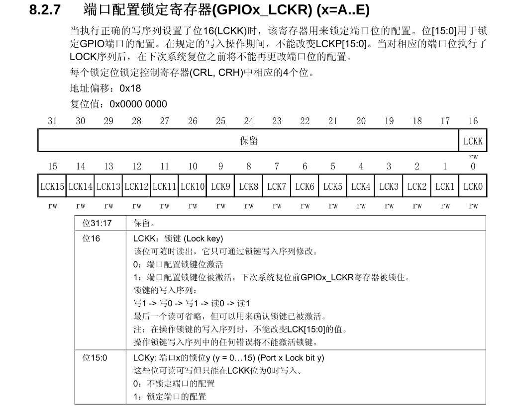

## 一句话定义

GPIOx_LCKR(配置锁定寄存器)用于锁定CRL/CRH配置寄存器的值,通过特定写入序列激活锁定,直至系统复位前不可修改。

## 核心内容

### 寄存器概述
- **功能定位**:锁定GPIO配置寄存器(CRL/CRH),防止意外修改
- **保护范围**:端口方向、速度、输入/输出模式等配置参数
- **锁定对象**:每个LCKy锁定对应引脚的4个配置位
- **锁定效果**:锁定后直至系统复位不可修改

### 寄存器结构
- **地址偏移**:0x18
- **复位值**:0x00000000(默认未锁定状态)
- **位域结构**:
  - 位16(LCKK):锁键控制位(全局锁定钥匙位)
  - 位15-0(LCKy):端口锁定位,对应GPIO的16个引脚(y=0-15)
- **LCKK(位16)**:
  - 锁定键控制位
  - 通过写入序列修改
  - 锁定整个LCKR寄存器的"总钥匙"
- **LCKy(位15-0)**:
  - 端口锁定位
  - 对应GPIO的16个引脚(y=0-15)
  - LCKy=1时锁定对应端口y的配置项

### 锁定原理
- **密码锁机制**:通过密码锁机制保护端口配置,防止误操作
- **类似密码锁设计**:需执行特定写入序列才能激活锁定功能
- **钥匙比喻**:LCKR寄存器相当于存放所有端口配置锁的"钥匙盒",每个LCKy位就是对应端口的钥匙

### 锁定级别
- **LCKK锁定**:全局级,一旦锁定必须等到系统复位才能解锁
- **LCKy锁定**:端口级,只要LCKK=0就可以通过程序修改

### 锁定机制
#### 操作序列
- **写入序列**:必须严格按"写1→写0→写1→读0→读1"顺序执行
  - 前三次写入构成"101"密码组合
  - 读0用于验证当前未锁定状态
  - 读1可省略,仅用于确认锁定成功
- **关键限制**:
  - 执行序列时不能改变LCK[15:0]的值
  - 任何步骤错误都会导致锁定失败
  - 锁定后需系统复位才能解除

#### 锁定位功能(LCK[15:0])
- **锁定对象**:每个锁定位(LCK0-LCK15)对应锁定GPIO配置寄存器(CRL/CRH)中的4个配置位
- **锁定机制**:
  - 当LCKy=1时,锁定对应端口y的配置项
  - 锁定后相当于给配置项"上锁",在复位前无法修改
  - LCKy=0时表示不锁定,可自由修改配置

#### 锁键作用与操作序列(LCKK)
- **全局锁定**:
  - LCKK位是锁定整个LCKR寄存器的"总钥匙"
  - 当LCKK=1时,整个LCKR寄存器被锁定,包括所有LCKy位
- **操作序列**:
  - 必须严格按照顺序执行:写1→写0→写1→读0→读1
  - 最后一个读操作可省略,但建议保留以确认锁定成功
- **特殊限制**:
  - 执行锁键序列时不能改变LCK[15:0]的值
  - 序列中任何错误都会导致锁定失败

### 生效条件
- **锁定级别**:
  - LCKK锁定是"全局级"的,一旦锁定必须等到系统复位才能解锁
  - LCKy锁定是"端口级"的,只要LCKK=0就可以通过程序修改
- **生效条件**:
  - 所有锁定操作在下一次系统复位前持续有效
  - 锁定后无法通过常规操作解除,必须复位系统
- **安全设计**:
  - 双层级锁定机制确保关键配置不会被意外修改
  - 严格的写入序列防止误操作导致锁定

### 典型用途
- **防止关键外设配置被意外修改**
- **增强系统运行稳定性**
- **保护重要GPIO状态(如复位引脚)**

### 注意事项
- **锁定后CRL/CRH控制寄存器对应位将不可修改**
- **每个LCKy位锁定对应引脚的4个配置位**
- **不影响ODR/IDR等数据寄存器的正常操作**
- **锁定后需复位才能重新配置**
- **设计意图**:
  - 避免"无限套娃"的钥匙保管问题
  - 通过密码机制确保操作者明确锁定意图
  - 防止误操作导致配置被意外锁定

## 注意事项 & 踩坑

- 锁定后CRL/CRH控制寄存器对应位将不可修改,必须复位系统才能解除锁定
- 执行锁键序列时不能改变LCK[15:0]的值,否则锁定失败
- 任何步骤错误都会导致锁定失败,必须严格按照"写1→写0→写1"顺序
- 锁定不影响ODR/IDR等数据寄存器的正常操作
- LCKK锁定后必须等到系统复位才能解锁,LCKy锁定只要LCKK=0就可以通过程序修改

## 相关笔记

- [GPIO配置寄存器CRL与CRH](GPIO配置寄存器CRL与CRH.md)

## 参考来源

- 尚硅谷嵌入式技术之STM32单片机课程
- STM32中文参考手册