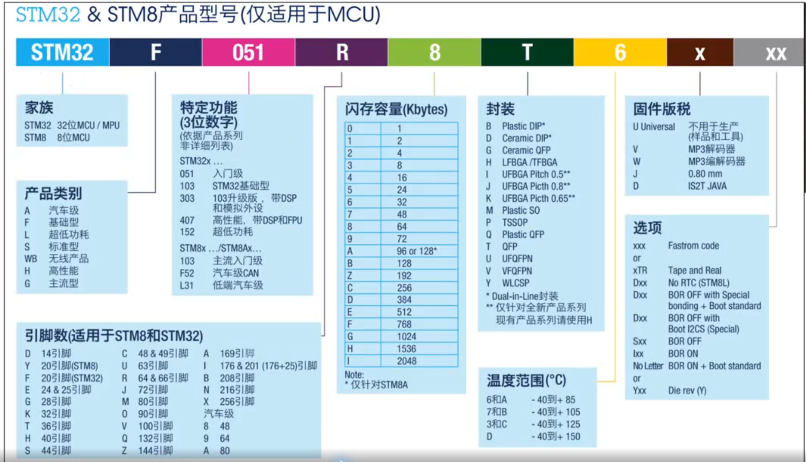

## 一句话定义
STM32是意法半导体（ST）推出的基于ARM Cortex-M系列内核的32位通用微控制器（MCU），是全球嵌入式市场占有率最高的MCU产品。

## 核心内容
### 1. ARM内核基础
- ARM是英国芯片设计公司，通过知识产权授权模式运营，不直接生产芯片
- Cortex系列分为三大产品线：
  - Cortex-A：高性能应用处理器，用于手机、平板等设备
  - Cortex-R：实时处理器，用于工业控制、汽车电子等对实时性要求高的场景
  - Cortex-M：微控制器专用内核，STM32全系列均采用该内核
- STM32主流内核型号：
  - Cortex-M0/M0+：低功耗入门级
  - Cortex-M3：主流级，最常用（如STM32F1系列）
  - Cortex-M4：带DSP指令集和FPU浮点单元，高性能
  - Cortex-M7：超高性能

### 2. STM32产品线分类
| 系列 | 定位 | 典型型号 | 应用场景 |
| --- | --- | --- | --- |
| F系列 | 基础通用型 | STM32F103、F407、F767 | 通用嵌入式开发、工业控制 |
| L系列 | 低功耗型 | STM32L0、L1、L4、L5 | 物联网设备、电池供电产品 |
| H系列 | 高性能型 | STM32H723、H743 | 高性能计算、图像处理、复杂控制 |
| G系列 | 新一代主流型 | STM32G0、G4 | 替代F系列，性价比更高 |
| WB/WL系列 | 无线通信型 | STM32WB55、WL55 | 蓝牙、LoRa、Zigbee无线应用 |
| U系列 | 超超低功耗型 | STM32U5 | 可穿戴设备、医疗传感器 |

### 3. STM32命名规则解析
以`STM32F103ZET6`为例：
- `STM32`：32位微控制器系列标识
- `F`：产品线系列（F基础型、L低功耗、H高性能等）
- `103`：子系列型号，代表性能等级和外设配置
- `Z`：引脚数标识，Z=144引脚、V=100、C=48、R=64
- `E`：闪存容量标识，E=512KB、C=256KB、B=128KB、8=64KB
- `T`：封装类型，T=LQFP封装、H=BGA封装、U=QFN封装
- `6`：温度等级，6=-40℃~+85℃工业级、7=-40℃~+105℃、D=汽车级-40℃~+150℃
- 

### 4. STM32核心优势
1. 性价比极高：32位性能，接近8位MCU的价格
2. 生态完善：官方提供标准库、HAL库、LL库，第三方资源丰富
3. 工具链成熟：Keil、IAR、STM32CubeIDE等多种开发工具支持
4. 产品线齐全：覆盖从入门级到高性能、低功耗、无线等全场景需求
5. 资料丰富：中文资料、教程、开源项目众多，学习门槛低

### 5. 典型应用场景
- 物联网设备：智能家居、传感器节点、智能门锁
- 工业控制：PLC、工业机器人、电机控制、数据采集
- 消费电子：智能手表、蓝牙耳机、游戏机外设
- 汽车电子：车身控制、仪表显示、辅助驾驶模块
- 医疗设备：监护仪、便携式医疗设备、健康传感器
- 电力能源：智能电表、电源管理、光伏逆变器

## 注意事项&踩坑
1. 选型时注意区分后缀：同一系列不同后缀的外设配置差异巨大，需仔细对照数据手册
2. 注意芯片版本：不同版本的寄存器定义可能有差异，优先选择量产时间长的成熟型号
3. 国内可替代型号：GD32、HK32、APM32等国产MCU均兼容STM32代码，可无缝替代

## 相关笔记
- [[最小系统组成]]
- [[windows下STM32开发环境搭建]]
