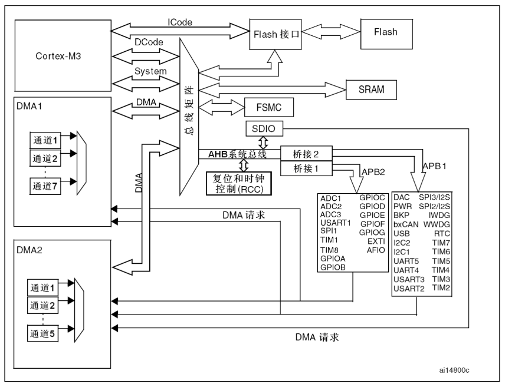

## 一句话定义
STM32采用多级总线架构，分为主动单元和被动单元，通过总线矩阵协调数据传输。
## 核心内容

1. 被动单元：
   - SRAM：相当于电脑内存，存储程序运行时的变量，容量64KB，速度比DRAM快
   - Flash：相当于硬盘，存储下载的程序和常量，容量512KB，单位成本低
   - 桥接部件：连接AHB系统总线到APB外设总线，分为APB1和APB2
2. 总线分类：
   - AHB：高级高性能总线，系统总线，最高频率72MHz
   - APB2：高速外设总线，最高72MHz，连接GPIO、ADC1、USART1等高速外设
   - APB1：低速外设总线，最高36MHz，连接USART2~5、I2C、SPI2/3等低速外设
3. 主动单元：
   - 内核总线：I-Code指令总线（直接从Flash取指）、D-Code数据总线（加载常量）、System系统总线（**访问SRAM（静态随机存取存储器）和片内外设**）
   - DMA控制器：无需CPU参与即可实现内存和外设间的数据传输，降低CPU负担
   - 总线矩阵：协调各单元对总线的访问，避免冲突
## 注意事项&踩坑
1. 不同外设挂载的总线不同，时钟配置和频率限制也不同
2. DMA传输可以大幅提高数据吞吐量，适合ADC、串口等大量数据传输场景
## 相关笔记

- [[Cortex-M3内核总线路径详解]]

## 参考来源
29.md STM32系统架构部分