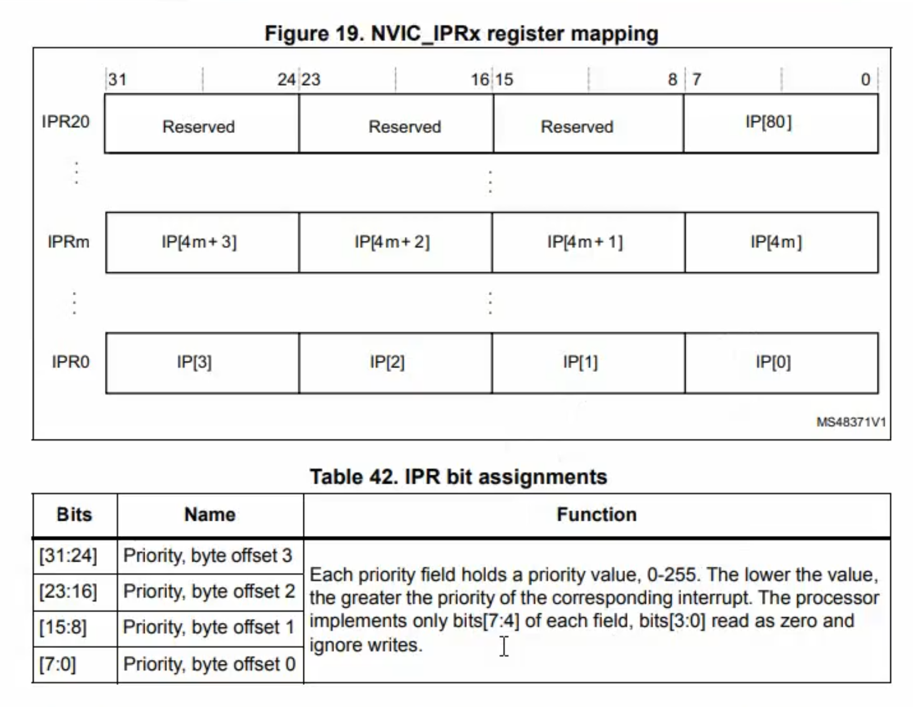
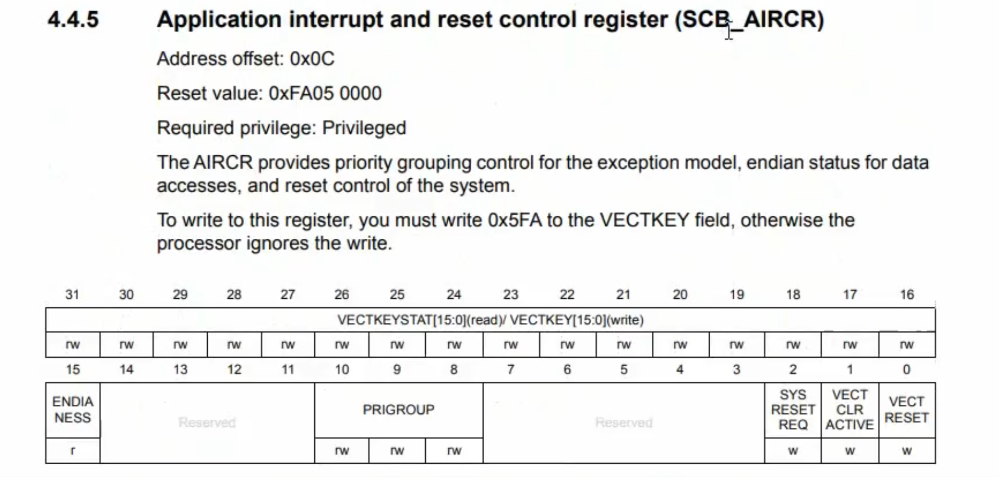

## 一句话定义

NVIC 中断优先级配置机制通过 SHPRx 和 NVIC_IPRx 寄存器设置优先级值，通过 SCB_AIRCR 寄存器的 PRIGROUP 字段配置优先级分组，实现灵活的中断优先级管理。

## 核心内容

### 编程方式

| 方式 | 说明 |
|------|------|
| **寄存器方式** | 理论上可直接操作 NVIC 相关寄存器，但由于 NVIC 与内核耦合紧密，实际中很少手动配置 |
| **库函数方式（推荐）** | 通过内核支持文件（`core_cm3.c`）提供的标准库函数进行配置，开发中统一使用此方式 |

### 优先级值的底层寄存器

#### 系统异常优先级 — SHPRx 寄存器

- 位置：内核 SCB（System Control Block）模块中
- 作用：配置**内核内部异常**的优先级
- 可配置的异常共 **6 种**（调试监控异常不可配置）：

| 异常类型 | 可配置 |
|----------|--------|
| Memory Management Fault | ✓ |
| Bus Fault | ✓ |
| Usage Fault | ✓ |
| SVCall | ✓ |
| PendSV | ✓ |
| SysTick | ✓ |
| Debug Monitor | ✗ |

- 另有 3 种异常（Reset、NMI、HardFault）优先级固定，不可配置

#### 外部中断优先级 — NVIC_IPRx 寄存器



- 位置：NVIC 模块中
- 寄存器数量：**21 个**（NVIC_IPR0 ~ NVIC_IPR20）
- 每个寄存器 32 位，划分为 4 个字段，每个字段 **8 位**
- 总计可配置：21 × 4 = **84 个**中断源的优先级（与 STM32 中断总数一致）

#### 有效位宽

| 项目 | 数值 |
|------|------|
| 寄存器中每个字段位宽 | 8 位 |
| 架构定义的优先级级数 | 256（0~255） |
| **STM32 实际生效位** | **高 4 位（bit7~bit4）** |
| 低 4 位（bit3~bit0） | 忽略写入，读回为 0 |
| **实际可配置优先级级数** | **16 种（0~15）** |

> 优先级值越小，优先级越高。默认优先级值为 0（最高优先级）。

### 优先级分组机制

#### 两级优先级的底层对应

| 用户概念 | 底层术语 | 含义 |
|----------|----------|------|
| 抢占优先级 | **Priority Group（优先级组）** | 决定能否打断正在执行的中断 |
| 响应优先级 | **Sub-Priority（子优先级）** | 决定同时挂起时的响应先后 |

#### 分组配置寄存器 — SCB_AIRCR

- 位置：SCB 模块的 AIRCR（Application Interrupt and Reset Control Register）寄存器
- 配置位：**PRIGROUP** 字段，共 **3 位**
- 取值范围：011（3）~ 111（7），共 5 种分组方案



#### 五种分组方案

有效优先级位共 4 位（bit7~bit4），在抢占与响应之间划分：

| PRIGROUP 值 | 分组模式 | 抢占优先级位 | 响应优先级位 | 抢占级数 | 响应级数 |
|:-----------:|:--------:|:----------:|:----------:|:-------:|:-------:|
| 3（011） | 模式 3 | [7:4]（4 位） | 无 | 16 | 0 |
| 4（100） | 模式 4 | [7:5]（3 位） | [4]（1 位） | 8 | 2 |
| 5（101） | 模式 5 | [7:6]（2 位） | [5:4]（2 位） | 4 | 4 |
| 6（110） | 模式 6 | [7]（1 位） | [6:4]（3 位） | 2 | 8 |
| 7（111） | 模式 7 | 无 | [7:4]（4 位） | 0 | 16 |

#### 各模式说明

**模式 3（全抢占）：**
- 4 位全部用于抢占优先级，共 16 级
- 所有中断之间均可按优先级高低相互抢占
- 无响应优先级，同时挂起时按向量表默认编号顺序处理

**模式 5（均分）：**
- 2 位抢占（4 级）+ 2 位响应（4 级）
- 同组内不可抢占，但同时挂起时按响应优先级排序

**模式 7（全响应）：**
- 4 位全部用于响应优先级
- 所有中断**均不可互相抢占**，仅决定同时挂起时的响应顺序

### 实际编程配置（推荐做法）

#### 步骤

```
步骤1：选择分组模式 → 调用 NVIC_PriorityGroupConfig()

步骤2：针对具体中断源配置优先级 → 调用 NVIC_Init()
```

#### 推荐分组方案

| 选择 | 理由 |
|------|------|
| **模式 3（全抢占）** | 配置最简单，只设一个优先级值即可，高优先级可打断低优先级，符合大多数应用场景 |

#### 代码示例

```c
// 步骤1：设置优先级分组为模式3（4位抢占，0位响应）
NVIC_PriorityGroupConfig(NVIC_PriorityGroup_3);

// 步骤2：配置某个中断源的优先级
NVIC_InitStructure.NVIC_IRQChannel = USART1_IRQn;
NVIC_InitStructure.NVIC_IRQChannelPreemptionPriority = 2;  // 抢占优先级（0~15）
NVIC_InitStructure.NVIC_IRQChannelSubPriority = 0;          // 响应优先级（模式3下无效）
NVIC_InitStructure.NVIC_IRQChannelCmd = ENABLE;
NVIC_Init(&NVIC_InitStructure);
```

> 全局只需设置一次分组模式；各中断源分别配置其优先级值即可。

## 注意事项 & 踩坑

- **优先级值范围**: 0~15（实际有效 4 位），默认优先级值为 0（最高优先级）
- **值越小优先级越高**: 容易混淆，需要特别注意
- **底层寄存器**: SHPRx（内部异常）、NVIC_IPRx（外部中断）
- **分组配置寄存器**: SCB_AIRCR 的 PRIGROUP 字段
- **底层术语**: 优先级组（Group）= 抢占优先级；子优先级（Sub）= 响应优先级
- **实际开发**: 调用标准库函数，无需直接操作寄存器

## 相关笔记

- [[STM32 中断体系架构]]
- [[NVIC 嵌套向量中断控制器]]
- [[中断优先级配置]]
- [[外部中断控制器 EXTI]]

## 参考来源

- STM32F103 参考手册 RM0008
- Cortex-M3 技术手册
- 原始笔记：NVIC 中断优先级配置机制.md