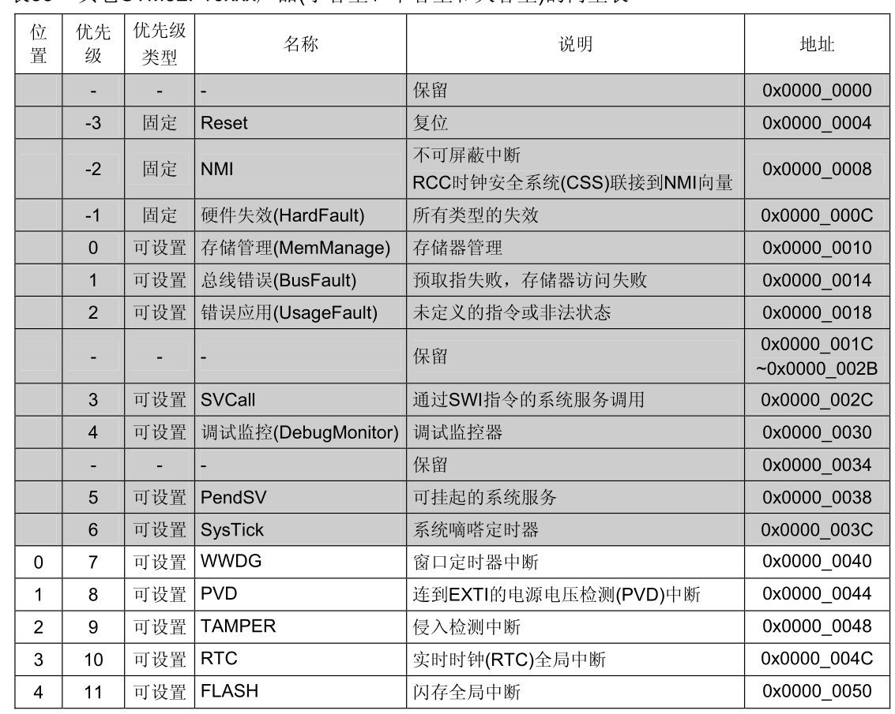

## 一句话定义

STM32基于Cortex-M3内核，理论支持256个中断，实际配置因系列而异，优先级采用4位16级可编程配置。

## 核心内容

### 中断数量配置

#### 理论支持
- **架构基础**: 基于Cortex-M3内核
- **理论中断数**: 256个中断
  - 16个内核中断
  - 240个外部中断

#### 实际配置

| 系列 | 总中断数 | 内核中断 | 外部中断 |
|------|---------|---------|---------|
| STM32系列最大 | 84个 | 16个 | 68个 |
| STM32F103系列 | 70个 | 10个 | 60个 |


![[Pasted image 20260528195222.png]]
### 中断向量表

中断向量表保存了中断名称与入口地址的对应关系：

- **地址间隔**: 每个中断向量占4字节
- **存储内容**: 保存的是中断处理程序的入口地址，而非完整程序
- **作用**: CPU通过向量表快速定位中断服务函数
优先级特性

#### 理论配置
- **位宽**: 8位
- **理论级数**: 256级优先级

#### 实际配置
- **位宽**: 4位（高4位有效）
- **可编程级数**: 16级优先级
- **优先级规则**: 数值越小，优先级越高

### 中断向量表地址示例

```
地址        中断名称
0x0800_0000  栈顶地址
0x0800_0004  Reset_Handler
0x0800_0008  NMI_Handler
0x0800_000C  HardFault_Handler
0x0800_0010  MemManage_Handler
...
```

## 注意事项 & 踩坑

- 中断向量表必须放在Flash起始位置（0x08000000）
- 优先级数值越小，优先级越高（容易混淆）
- 4位优先级实际只有高4位有效，低4位读回为0

## 相关笔记

- [[中断概述]]
- [[NVIC 嵌套向量中断控制器]]
- [[中断优先级配置]]

## 参考来源

- STM32F103 参考手册
- Cortex-M3 技术手册
