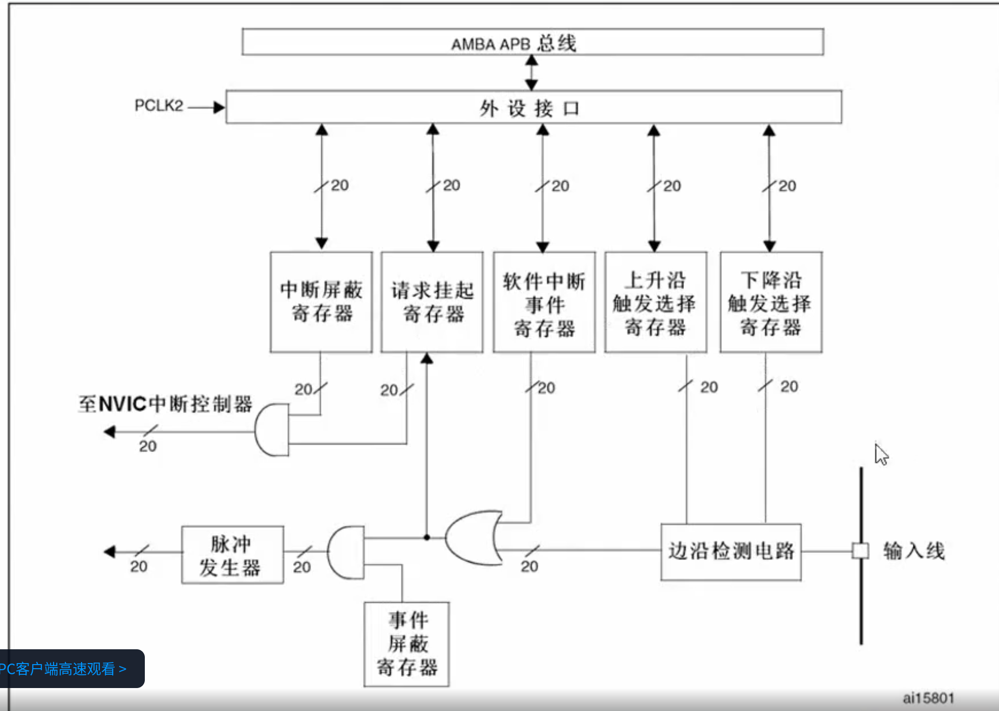

## 一句话定义

EXTI (External Interrupt/Event Controller) 是 STM32 的外部中断/事件控制器，提供 19 个外部线用于处理外部引脚的中断和事件请求，支持边沿触发和事件模式。

## 核心内容

### EXTI 电路总体结构



信号流经路径：

```
GPIO输入线 → 边缘检测电路 → 请求挂起寄存器 → 中断屏蔽寄存器 → NVIC（中断请求）
                                                         |
                                                    脉冲发生器 → 事件响应（硬件处理）
```

电路中包含以下两类通路：

| 通路 | 处理方式 | 最终去向 |
|------|----------|----------|
| **中断通路（上方）** | 软件处理（经 NVIC → 内核 → 执行中断服务程序） | NVIC |
| **事件通路（下方）** | 硬件处理（脉冲发生器直接驱动外设操作） | 特定硬件电路 |

> 事件通路不经过 NVIC 和 CPU，响应速度更快，但仅适用于特定硬件可直接处理的场景，实际使用较少。

### EXTI 功能特性

1. **19 个外部线**: 对应 GPIO 引脚和内部信号
2. **边沿触发**: 支持上升沿、下降沿或双边沿触发
3. **事件模式**: 可产生事件而不触发中断
4. **独立配置**: 每个外部线可独立配置
5. **中断屏蔽**: 支持单独屏蔽某个外部线

### EXTI 外部线映射

| 外部线 | 信号来源 | 说明 |
|--------|---------|------|
| EXTI0 | GPIO Port A | 可映射到 PA0 |
| EXTI1 | GPIO Port B | 可映射到 PB1 |
| EXTI2 | GPIO Port C | 可映射到 PC2 |
| EXTI3 | GPIO Port D | 可映射到 PD3 |
| EXTI4 | GPIO Port E | 可映射到 PE4 |
| EXTI5-9 | GPIO Port A-J | 对应相同数字的引脚 |
| EXTI10-15 | GPIO Port A-J | 对应相同数字的引脚 |
| EXTI16 | PVD 输出 | 电源电压检测 |
| EXTI17 | RTC 闹钟 | RTC 闹钟事件 |
| EXTI18 | USB 唤醒 | USB 唤醒事件 |
| EXTI19 | 以太网唤醒 | 以太网唤醒事件 |

### EXTI 触发模式

#### 边沿触发模式

- **上升沿触发**: 信号从低电平变为高电平时触发
- **下降沿触发**: 信号从高电平变为低电平时触发
- **双边沿触发**: 上升沿和下降沿都触发

```c
// 配置 EXTI0 为上升沿触发
EXTI_InitTypeDef EXTI_InitStructure;
EXTI_InitStructure.EXTI_Line = EXTI_Line0;
EXTI_InitStructure.EXTI_Mode = EXTI_Mode_Interrupt;
EXTI_InitStructure.EXTI_Trigger = EXTI_Trigger_Rising;  // 上升沿
EXTI_InitStructure.EXTI_LineCmd = ENABLE;
EXTI_Init(&EXTI_InitStructure);
```

#### 事件模式

- **产生事件**: 不触发中断，仅产生内部事件信号
- **可用于**: 触发 ADC、DMA 等其他外设
- **边沿选择**: 同样支持上升沿、下降沿或双边沿

```c
// 配置 EXTI0 为事件模式
EXTI_InitStructure.EXTI_Mode = EXTI_Mode_Event;
EXTI_InitStructure.EXTI_Trigger = EXTI_Trigger_Rising_Falling;
EXTI_Init(&EXTI_InitStructure);
```

### 中断通路与事件通路对比

| 对比项 | 中断通路 | 事件通路 |
|--------|----------|----------|
| 信号路径 | PR → IMR → NVIC → CPU | EMR → 脉冲发生器 → 硬件电路 |
| 处理方式 | 软件处理（执行中断服务程序） | 硬件处理（纯电路完成） |
| 响应速度 | 较慢（需软件介入） | 更快（纯硬件响应） |
| 通用性 | 通用，适用于所有外部中断源 | 仅适用于有专用硬件处理电路的特定事件 |
| 使用频率 | 常用 | 较少使用 |

### EXTI 寄存器

#### 中断屏蔽寄存器 (IMR)

- **位 0-18**: 对应外部线 0-18 的屏蔽位
- **1 = 屏蔽**: 禁止该外部线产生中断
- **0 = 使能**: 允许该外部线产生中断

```c
// 使能 EXTI0 中断
EXTI->IMR &= ~EXTI_IMR_MR0;

// 屏蔽 EXTI0 中断
EXTI->IMR |= EXTI_IMR_MR0;
```

#### 事件屏蔽寄存器 (EMR)

- **位 0-18**: 对应外部线 0-18 的屏蔽位
- **1 = 屏蔽**: 禁止该外部线产生事件
- **0 = 使能**: 允许该外部线产生事件

#### 触发选择寄存器 (RTSR/FTSR)

- **RTSR**: 上升沿触发选择寄存器
- **FTSR**: 下降沿触发选择寄存器
- **1 = 使能**: 该位对应的外部线使能对应边沿触发

```c
// 配置 EXTI0 双边沿触发
EXTI->RTSR |= EXTI_RTSR_TR0;  // 使能上升沿
EXTI->FTSR |= EXTI_FTSR_TR0;  // 使能下降沿
```

#### 挂起寄存器 (PR)

- **位 0-18**: 对应外部线 0-18 的挂起位
- **1 = 有挂起**: 该外部线有中断/事件请求
- **写 1 清零**: 写 1 到该位可清除挂起状态

```c
// 检查 EXTI0 是否有挂起
if (EXTI->PR & EXTI_PR_PR0) {
    // 清除挂起
    EXTI->PR = EXTI_PR_PR0;
}
```

### 中断处理完整流程

```
① GPIO引脚输入信号变化（上升沿/下降沿）
         ↓
② 边缘检测电路检测信号
   （依据 RTSR/FTSR 配置判断检测类型）
         ↓
③ 硬件自动将请求挂起寄存器（PR）对应位置 1
         ↓
④ 与中断屏蔽寄存器（IMR）对应位相与（AND）
         ↓
   ┌── IMR对应位 = 0 → 屏蔽，中断请求不传递
   └── IMR对应位 = 1 → 中断请求传递至 NVIC
                             ↓
⑤ NVIC 进行优先级仲裁
                             ↓
⑥ 内核响应，执行中断服务程序
                             ↓
⑦ 中断服务程序中，软件写 1 清零 PR 对应位
   （清除挂起标志，结束本次中断）
```

### EXTI 配置步骤

```c
// 1. 使能 AFIO 时钟 (EXTI 依赖 AFIO)
RCC_APB2PeriphClockCmd(RCC_APB2Periph_AFIO, ENABLE);

// 2. 配置 GPIO 为浮空输入或上拉输入
GPIO_InitTypeDef GPIO_InitStructure;
GPIO_InitStructure.GPIO_Pin = GPIO_Pin_0;
GPIO_InitStructure.GPIO_Mode = GPIO_Mode_IPU;  // 上拉输入
GPIO_Init(GPIOA, &GPIO_InitStructure);

// 3. 将 GPIO 引脚映射到 EXTI 线
GPIO_EXTILineConfig(GPIO_PortSourceGPIOA, GPIO_PinSource0);

// 4. 配置 EXTI 参数
EXTI_InitTypeDef EXTI_InitStructure;
EXTI_InitStructure.EXTI_Line = EXTI_Line0;
EXTI_InitStructure.EXTI_Mode = EXTI_Mode_Interrupt;
EXTI_InitStructure.EXTI_Trigger = EXTI_Trigger_Rising_Falling;
EXTI_InitStructure.EXTI_LineCmd = ENABLE;
EXTI_Init(&EXTI_InitStructure);

// 5. 配置 NVIC
NVIC_InitTypeDef NVIC_InitStructure;
NVIC_InitStructure.NVIC_IRQChannel = EXTI0_IRQn;
NVIC_InitStructure.NVIC_IRQChannelPreemptionPriority = 0;
NVIC_InitStructure.NVIC_IRQChannelSubPriority = 0;
NVIC_InitStructure.NVIC_IRQChannelCmd = ENABLE;
NVIC_Init(&NVIC_InitStructure);
```

### EXTI 中断服务函数

```c
// EXTI0 中断服务函数
void EXTI0_IRQHandler(void)
{
    // 检查 EXTI0 是否触发
    if (EXTI_GetITStatus(EXTI_Line0) != RESET) {
        // 处理中断
        // ...
        
        // 清除中断标志
        EXTI_ClearITPendingBit(EXTI_Line0);
    }
}
```

## 注意事项 & 踩坑

- **端口映射冲突**: EXTI0-4 只能映射到同一数字的 GPIO 端口
- **时钟使能**: 必须使能 AFIO 时钟，否则 EXTI 不工作
- **GPIO 模式**: GPIO 必须配置为输入模式 (浮空/上拉/下拉)
- **中断清除**: 必须在中断服务函数中清除挂起标志
- **消抖处理**: 按键等机械开关需要软件或硬件消抖

## 相关笔记

- [[中断概述]]
- [[STM32 中断体系架构]]
- [[NVIC 嵌套向量中断控制器]]
- [[EXTI 按键中断实验]]

## 参考来源

- STM32F103 参考手册 RM0008
- STM32F103 数据手册
- 原始笔记：45.md, 47.md
